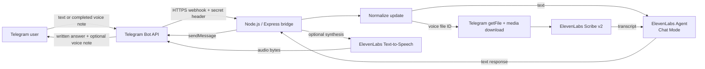
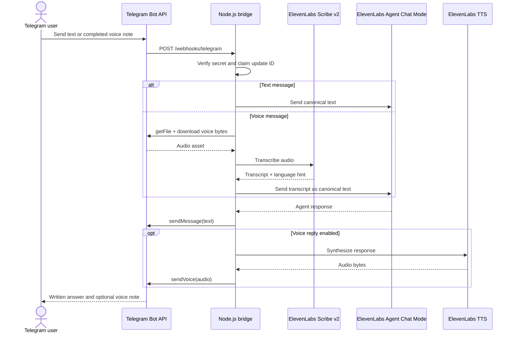
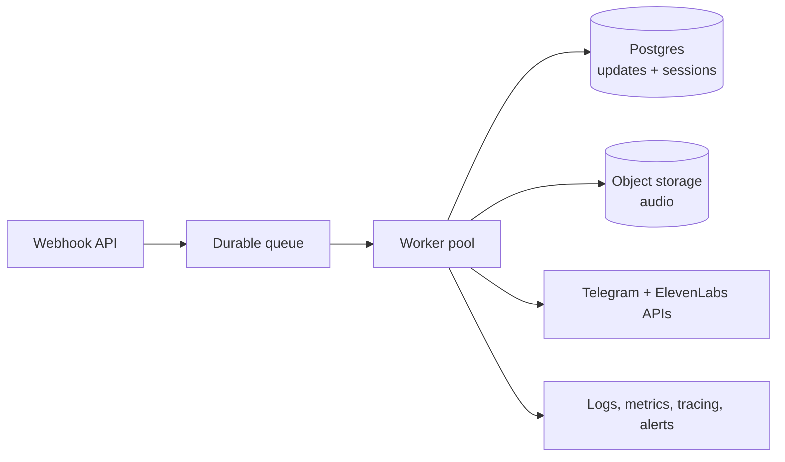

# Architecture — Telegram Voice-Message Agent

## System context

## Request flow

## Boundary ownership

| Boundary | Responsibility |
|---|---|
| Telegram | User identity, bot transport, webhook delivery, voice-file retrieval, text and voice delivery |
| Node.js bridge | Authentication, normalization, orchestration, idempotency, error messages, configuration |
| ElevenLabs Scribe v2 | Batch speech-to-text for completed voice notes |
| ElevenLabs Agent Chat Mode | Conversational reasoning and response generation |
| ElevenLabs TTS | Optional response audio rendering |

## Reliability and security

- Telegram webhook requests require `X-Telegram-Bot-Api-Secret-Token` verification.
- Credentials are loaded from local environment configuration and are not embedded in source code.
- Duplicate Telegram updates are rejected by the idempotency store.
- Voice-file and reply-size limits protect the demo service from oversized payloads.
- Text delivery is treated as the primary success path; a TTS failure does not invalidate a successful written response.
- The prototype awaits processing for demo clarity. A production deployment should acknowledge quickly, persist the update, enqueue work, and process STT, agent, TTS, and delivery in workers.

## Production evolution

The current repository deliberately keeps the operational surface small for an interview demonstration. The next production step is to replace the in-memory idempotency store and in-request processing with durable state, queue-backed workers, retry policies, and provider-aware rate limiting.